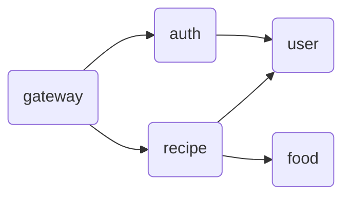

# PFC-balancer

```mermaid
graph LR;
    A(gateway) --> B(auth)
    A(gateway) --> C(recipe)
    B --> D(user)
    C --> D
    C --> E(food)
```
## Microservices
### Gateway
### Auth
### Users
- Port: `localhost:50054`
### Recipe
### Food
### DB
- Port: `localhost:5000`
