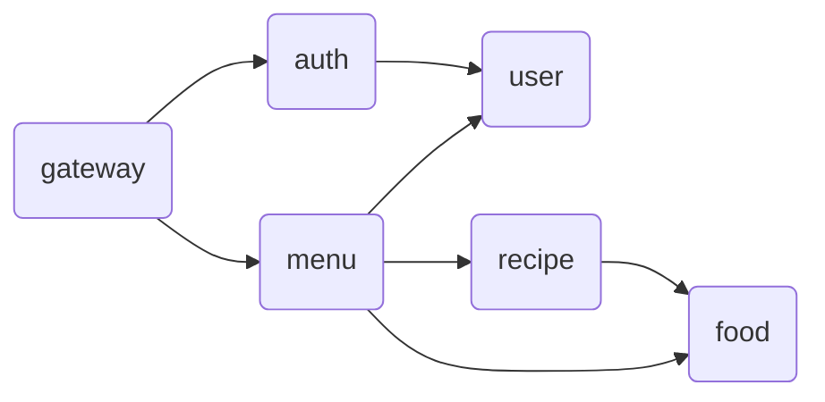

# PFC-balancer



## Get started
``` bash
# start up postgres
docker compose up -d

# run each services
make
```

## Microservices
### Gateway
- Port: `localhost:4000`
### Auth
- Port: `localhost:50051`
### Users
- Port: `localhost:50052`
### Menu
- Port: `localhost:50053`
### Recipe
- Port: `localhost:50054`
### Food
- Port: `localhost:50055`
### DB
- Port: `localhost:5000`

## Reference
### gRPC Gateway
The `google` directory was copied from [googleapis](https://github.com/googleapis/googleapis) to generate stubs for the gPRC gateway with the `protoc` command.
