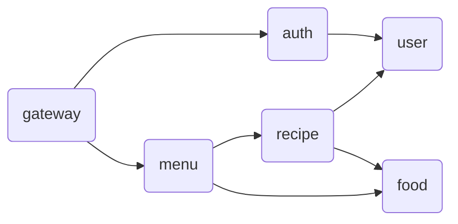

# PFC-balancer
PFC-balancer is a microservice that allows you to create and retrieve information about foods and recipes based on them.



## Get started
``` bash
# start up postgres
docker compose up -d

# run each services
make
```

## Microservices
### Gateway
- Port: `localhost:4000`
### Auth
- Port: `localhost:50051`
### Users
- Port: `localhost:50052`
### Menu
- Port: `localhost:50053`
### Recipe
- Port: `localhost:50054`
### Food
- Port: `localhost:50055`
### DB
- Port: `localhost:5000`

## Endpoints
Specify the following path followed by `localhost:4000`
| Service | Method | Endpoint       |
|---------|--------|----------------|
| Resister  | `POST` | `/auth/register/` |
| Login  | `POST` | `/auth/login/` |
| Find food by ID | `GET` | `/menu/foods/{id}` |
| List all foods  | `GET` | `/menu/foods` |
| Search foods  | `GET` | `/menu/foods/search/{name}` |

## Reference
- [grpc-gateway](https://github.com/grpc-ecosystem/grpc-gateway)
    - The `google` directory was copied from [googleapis](https://github.com/googleapis/googleapis) to generate stubs for the gPRC gateway with the `protoc` command.

- [Microservices in Go with gRPC, API Gateway, and Authentication — Part 1/2](https://levelup.gitconnected.com/microservices-with-go-grpc-api-gateway-and-authentication-part-1-2-393ad9fc9d30)

- [mercari-microservices-example](https://github.com/mercari/mercari-microservices-example)
