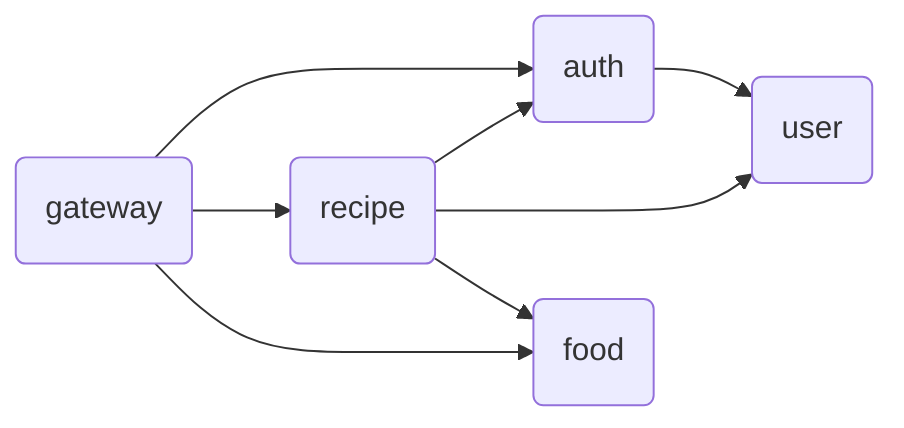
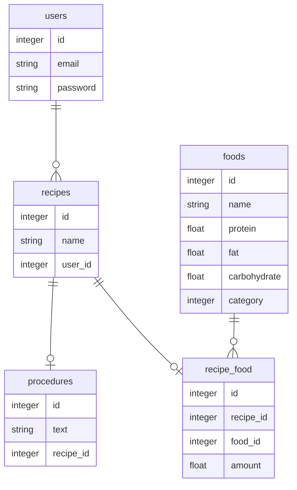

# PFC-balancer
PFC-balancer is a microservice that allows you to create and retrieve information about foods and recipes based on them.

This service was created with reference to [mercari-microservices-example](https://github.com/mercari/mercari-microservices-example).

## Architecture


## Microservices
### Gateway
- Port: `4000`
- This is the only microservice which is facing the out side of the services and acts as just a proxy.
### Auth
- Port: `50051`
- This microservice is responsible for issuing the access token (JWT) for the user.
- This microservice also provides the ability to validate the Auth information contained in the request.
### User
- Port: `50052`
- This microservice is responsible for storing the user information to the database and providing it as APIs.
### Recipe
- Port: `50053`
- This microservice is responsible for storing the recipe information to the database and providing it as APIs.
### Food
- Port: `50054`
- This microservice is responsible for providing food information from database as APIs.
### DB
- Port: `50000`
- This microservice is responsible for storing the user, recipe and food information.

## Get started
``` bash
# Build each service Docker images and
# run containers based on these.
$ make
```

## Endpoints
Specify the following path followed by `localhost:4000`
### Auth
| Service | Method | Endpoint       | Auth |
|---------|--------|----------------|------|
| Resister  | `POST` | `/auth/register/` | × |
| Login  | `POST` | `/auth/login/` | × |
### Food
| Service | Method | Endpoint       | Auth |
|---------|--------|----------------|------|
| List all foods  | `GET` | `/foods` | × |
| Find food by ID | `GET` | `/foods/{id}` | × |
| Search foods  | `GET` | `/foods/search/{name}` | × |
### Recipe
| Service | Method | Endpoint       | Auth |
|---------|--------|----------------|------|
| Create new recipe  | `POST` | `/recipes` | ✔︎ |
| List all recipes  | `GET` | `/recipes` | × |
| Find recipe by ID  | `GET` | `/recipes/{id}` | × |

## DB schema


## Reference
- [grpc-gateway](https://github.com/grpc-ecosystem/grpc-gateway)
    - The `google` directory was copied from [googleapis](https://github.com/googleapis/googleapis) to generate stubs for the gPRC gateway with the `protoc` command.

- [Microservices in Go with gRPC, API Gateway, and Authentication — Part 1/2](https://levelup.gitconnected.com/microservices-with-go-grpc-api-gateway-and-authentication-part-1-2-393ad9fc9d30)

- [mercari-microservices-example](https://github.com/mercari/mercari-microservices-example)

- [日本食品標準成分表・資源に関する取組:文部科学省](https://www.mext.go.jp/a_menu/syokuhinseibun/)
